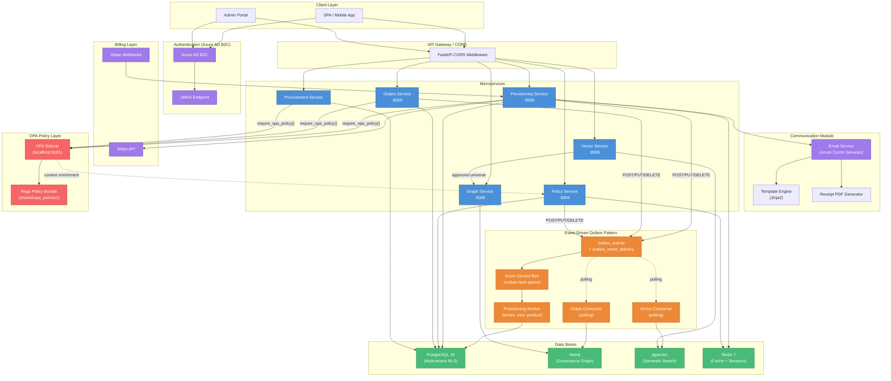
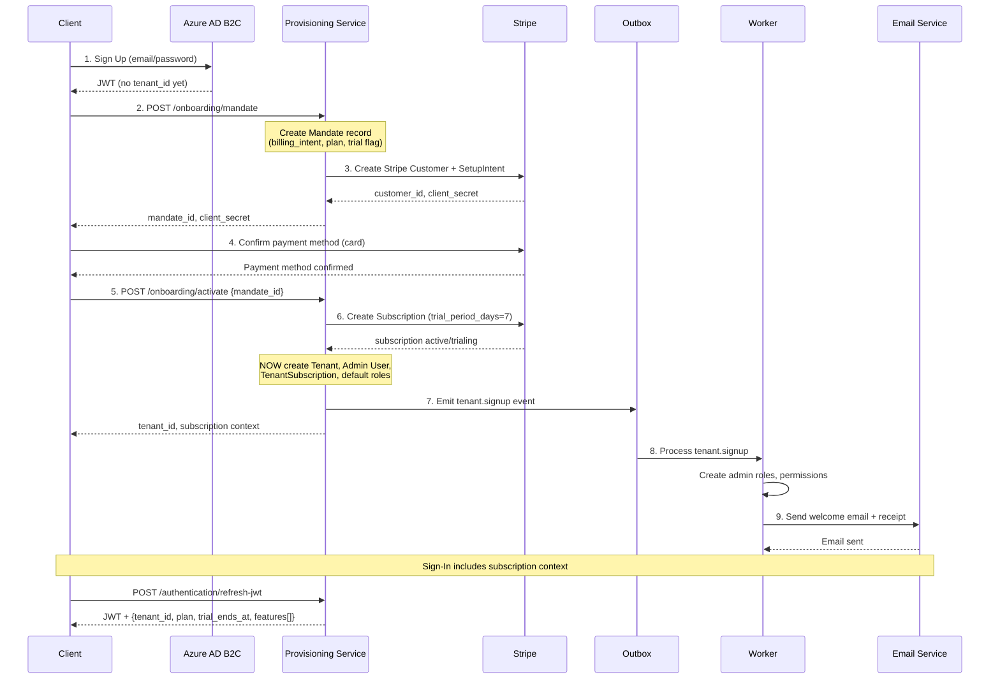
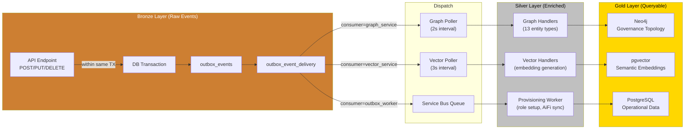
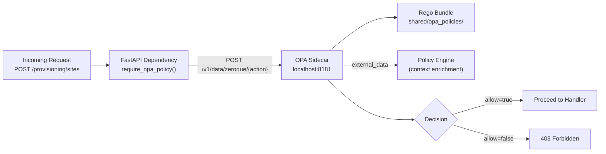

# ZeroQue System Architecture

## High-Level Architecture

```mermaid
flowchart TB
    subgraph Client["Client Layer"]
        SPA["SPA / Mobile App"]
        ADMIN["Admin Portal"]
    end

    subgraph AUTH["Authentication (Azure AD B2C)"]
        AZURE_AD["Azure AD B2C"]
        JWKS["JWKS Endpoint"]
    end

    subgraph GATEWAY["API Gateway / CORS"]
        GW["FastAPI CORS Middleware"]
    end

    subgraph BILLING["Billing Layer"]
        STRIPE["Stripe API"]
        STRIPE_WH["Stripe Webhooks"]
    end

    subgraph COMMS["Communication Module"]
        EMAIL_SVC["Email Service<br/>(Azure Comm Services)"]
        TEMPLATES["Template Engine<br/>(Jinja2)"]
        PDF_GEN["Receipt PDF Generator"]
    end

    subgraph SERVICES["Microservices"]
        PROV["Provisioning Service<br/>:8000"]
        POLICY["Policy Service<br/>:8004"]
        GRAPH["Graph Service<br/>:8005"]
        VECTOR["Vector Service<br/>:8006"]
        ORDERS["Orders Service<br/>:8008"]
        PROCURE["Procurement Service"]
    end

    subgraph OPA_LAYER["OPA Policy Layer"]
        OPA["OPA Sidecar<br/>(localhost:8181)"]
        REGO["Rego Policy Bundle<br/>(shared/opa_policies/)"]
    end

    subgraph OUTBOX["Event-Driven Outbox Pattern"]
        OB_TABLE["outbox_events<br/>+ outbox_event_delivery"]
        SB["Azure Service Bus<br/>(outbox-task-queue)"]
        PROV_WORKER["Provisioning Worker<br/>(tenant, user, product)"]
        GRAPH_CONSUMER["Graph Consumer<br/>(polling)"]
        VECTOR_CONSUMER["Vector Consumer<br/>(polling)"]
    end

    subgraph DATA["Data Stores"]
        PG["PostgreSQL 15<br/>(Multi-tenant RLS)"]
        NEO4J["Neo4j<br/>(Governance Graph)"]
        PGVEC["pgvector<br/>(Semantic Search)"]
        REDIS["Redis 7<br/>(Cache + Sessions)"]
    end

    %% Client flows
    SPA --> AZURE_AD
    ADMIN --> AZURE_AD
    AZURE_AD --> JWKS
    SPA --> GW
    ADMIN --> GW

    %% Gateway to services
    GW --> PROV
    GW --> POLICY
    GW --> GRAPH
    GW --> VECTOR
    GW --> ORDERS
    GW --> PROCURE

    %% Stripe billing
    STRIPE_WH --> PROV
    PROV --> STRIPE

    %% Communication
    PROV --> EMAIL_SVC
    EMAIL_SVC --> TEMPLATES
    EMAIL_SVC --> PDF_GEN

    %% OPA enforcement on every mutating endpoint
    PROV -->|"require_opa_policy()"| OPA
    ORDERS -->|"require_opa_policy()"| OPA
    PROCURE -->|"require_opa_policy()"| OPA
    OPA --> REGO
    OPA -.->|"context enrichment"| POLICY

    %% Outbox flow
    PROV -->|"POST/PUT/DELETE"| OB_TABLE
    ORDERS -->|"POST/PUT/DELETE"| OB_TABLE
    POLICY -->|"POST/PUT/DELETE"| OB_TABLE
    OB_TABLE --> SB
    SB --> PROV_WORKER
    OB_TABLE -.->|"polling"| GRAPH_CONSUMER
    OB_TABLE -.->|"polling"| VECTOR_CONSUMER

    %% Workers write to enriched stores
    GRAPH_CONSUMER --> NEO4J
    VECTOR_CONSUMER --> PGVEC
    PROV_WORKER --> PG

    %% Services to data stores
    PROV --> PG
    POLICY --> PG
    ORDERS --> PG
    PROCURE --> PG
    GRAPH --> NEO4J
    VECTOR --> PGVEC
    PROV --> REDIS
    POLICY --> REDIS

    %% Cross-service calls
    VECTOR -->|"approved universe"| GRAPH

    classDef service fill:#4A90D9,stroke:#2C5F8A,color:#fff
    classDef data fill:#48BB78,stroke:#2F855A,color:#fff
    classDef event fill:#ED8936,stroke:#C05621,color:#fff
    classDef external fill:#9F7AEA,stroke:#6B46C1,color:#fff
    classDef opa fill:#F56565,stroke:#C53030,color:#fff

    class PROV,POLICY,GRAPH,VECTOR,ORDERS,PROCURE service
    class PG,NEO4J,PGVEC,REDIS data
    class OB_TABLE,SB,PROV_WORKER,GRAPH_CONSUMER,VECTOR_CONSUMER event
    class STRIPE,STRIPE_WH,AZURE_AD,JWKS,EMAIL_SVC external
    class OPA,REGO opa
```

## Onboarding & Billing Sequence

```mermaid
sequenceDiagram
    participant C as Client
    participant AZ as Azure AD B2C
    participant P as Provisioning Service
    participant S as Stripe
    participant OB as Outbox
    participant W as Worker
    participant E as Email Service

    C->>AZ: 1. Sign Up (email/password)
    AZ-->>C: JWT (no tenant_id yet)

    C->>P: 2. POST /onboarding/mandate
    Note over P: Create Mandate record<br/>(billing_intent, plan, trial flag)
    P->>S: 3. Create Stripe Customer + SetupIntent
    S-->>P: customer_id, client_secret
    P-->>C: mandate_id, client_secret

    C->>S: 4. Confirm payment method (card)
    S-->>C: Payment method confirmed

    C->>P: 5. POST /onboarding/activate {mandate_id}
    P->>S: 6. Create Subscription (trial_period_days=7)
    S-->>P: subscription active/trialing
    Note over P: NOW create Tenant, Admin User,<br/>TenantSubscription, default roles

    P->>OB: 7. Emit tenant.signup event
    P-->>C: tenant_id, subscription context

    OB->>W: 8. Process tenant.signup
    W->>W: Create admin roles, permissions
    W->>E: 9. Send welcome email + receipt
    E-->>W: Email sent

    Note over C,E: Sign-In includes subscription context
    C->>P: POST /authentication/refresh-jwt
    P-->>C: JWT + {tenant_id, plan, trial_ends_at, features[]}
```

## Outbox Event Flow (Medallion Architecture)

```mermaid
flowchart LR
    subgraph BRONZE["Bronze Layer (Raw Events)"]
        API["API Endpoint<br/>POST/PUT/DELETE"]
        TX["DB Transaction"]
        OE["outbox_events"]
        OED["outbox_event_delivery"]
    end

    subgraph DISPATCH["Dispatch"]
        SB["Service Bus Queue"]
        POLL_G["Graph Poller<br/>(2s interval)"]
        POLL_V["Vector Poller<br/>(3s interval)"]
    end

    subgraph SILVER["Silver Layer (Enriched)"]
        GH["Graph Handlers<br/>(13 entity types)"]
        VH["Vector Handlers<br/>(embedding generation)"]
        PW["Provisioning Worker<br/>(role setup, AiFi sync)"]
    end

    subgraph GOLD["Gold Layer (Queryable)"]
        NEO["Neo4j<br/>Governance Topology"]
        PGV["pgvector<br/>Semantic Embeddings"]
        PG["PostgreSQL<br/>Operational Data"]
    end

    API -->|"within same TX"| TX
    TX --> OE
    OE --> OED
    OED -->|"consumer=outbox_worker"| SB
    OED -->|"consumer=graph_service"| POLL_G
    OED -->|"consumer=vector_service"| POLL_V
    SB --> PW
    POLL_G --> GH
    POLL_V --> VH
    PW --> PG
    GH --> NEO
    VH --> PGV

    style BRONZE fill:#CD7F32,color:#fff
    style SILVER fill:#C0C0C0,color:#000
    style GOLD fill:#FFD700,color:#000
```

## OPA/Rego Policy Enforcement

```mermaid
flowchart LR
    REQ["Incoming Request<br/>POST /provisioning/sites"]
    DEP["FastAPI Dependency<br/>require_opa_policy()"]
    OPA["OPA Sidecar<br/>localhost:8181"]
    BUNDLE["Rego Bundle<br/>shared/opa_policies/"]
    PE["Policy Engine<br/>(context enrichment)"]
    DECISION{Decision}
    ALLOW["Proceed to Handler"]
    DENY["403 Forbidden"]

    REQ --> DEP
    DEP -->|"POST /v1/data/zeroque/{action}"| OPA
    OPA --> BUNDLE
    OPA -.->|"external_data"| PE
    OPA --> DECISION
    DECISION -->|"allow=true"| ALLOW
    DECISION -->|"allow=false"| DENY
```
