# Seed Features & Plans (Core / Pro / Enterprise)

Three-plan structure to align features with clear upsell paths. Use this as the seed list for `features`, `plans`, and plan-feature mappings.

## Plans

- Core — Single-site/manual; basics for catalog, pricing, reporting, compliance.
- Pro — Multi-site/semi-automated; POS/ERP read-only; campaign & HR integrations.
- Enterprise — Regional/global; real-time sync, CV/IoT/automation, predictive/advanced compliance.

## Feature Catalog by Cluster

### Identity & Access

- Multi-store access federation — Pro/Ent
- Shopper behaviour tracking (anonymous, CV) — Ent (Beta)
- In-store staff scheduling integration — Pro/Ent
- Multi-site facility access control — Pro/Ent
- Contractor & visitor credentialing — Pro/Ent
- Machine zone-based access — Ent

### Catalogue & Inventory

- Planogram & shelf mapping — Pro/Ent
- Dynamic price synchronization — Pro/Ent
- Product substitution engine — Ent (Beta)
- Bill of Materials (BOM) linking — Pro/Ent
- Production consumption tracking — Pro/Ent
- MRO catalog sync — Ent

### Budgets & Spend Control

- Store-level spend visibility — Core/Pro/Ent
- Promotional budget allocation — Pro/Ent
- Cost centre hierarchy mapping — Core/Pro/Ent
- Usage-based replenishment rules — Pro/Ent

### Reporting & Analytics

- Store performance dashboard — Pro/Ent
- Conversion & dwell-time analytics (CV) — Ent (Beta)
- Promotion ROI tracking — Pro/Ent
- Production efficiency dashboard — Pro/Ent
- Maintenance and downtime alerts — Ent
- CO₂ / ESG consumption footprint — Ent

### Compliance & Brand / Audit

- Store visual compliance audit (CV) — Pro/Ent
- Temperature & safety logging (IoT) — Core/Pro/Ent
- Brand asset approval workflow — Pro/Ent
- Machine/operator safety linkage — Pro/Ent
- Lot traceability (materials) — Ent
- Certificate of Conformity auto-storage — Pro/Ent

### Integrations & Automation

- POS Integration Pack — Pro/Ent
- Loyalty & Rewards API — Ent
- Pricing Automation Engine — Ent (Beta)
- ERP Integration Pack (SAP/Oracle/Epicor) — Pro/Ent (read-only → write-back)
- IoT Sensor Stream Connector — Ent
- Workflow Automation Rules Engine — Ent

## Plan Differentiation (selected hooks)

- Core: Single-site, manual pricing/catalog, basic reporting, basic compliance, manual budget visibility.
- Pro: Multi-site, batch/bulk ops, HR scheduling, POS/ERP read-only, campaign tracking, automation seeds (thresholds), dashboards.
- Enterprise: Real-time sync (POS/ERP), CV/IoT-powered analytics, dynamic pricing, loyalty, automation rules engine, ESG/traceability, advanced compliance.

## Visual Coverage

```mermaid
flowchart TD
    CORE(Core)
    PRO(Pro)
    ENT(Enterprise)

    CORE -->|shared| F1[Store spend visibility]
    CORE -->|shared| F2[Temp & safety logging]
    PRO -->|adds| F3[Multi-store access federation]
    PRO -->|adds| F4[Staff scheduling]
    PRO -->|adds| F5[Planogram mapping]
    PRO -->|adds| F6[POS/ERP read-only]
    PRO -->|adds| F7[Promo budget + ROI tracking]
    ENT -->|adds| F8[CV shopper tracking / dwell]
    ENT -->|adds| F9[Dynamic pricing sync]
    ENT -->|adds| F10[Product substitution engine]
    ENT -->|adds| F11[Workflow automation rules]
    ENT -->|adds| F12[IoT connector + maintenance alerts]
    ENT -->|adds| F13[ESG/traceability]
    ENT -->|adds| F14[Loyalty & rewards]
    ENT -->|adds| F15[ERP write-back]
```

## Upgrade Hooks / Triggers (examples)

- Stores > 1 → Core → Pro
- Stores > 5 or turnover > £500k/mo → Pro → Enterprise
- CV-enabled stores > 3 → Enterprise (CV analytics/planogram)
- POS transactions > 5k/mo or SKUs > 10k → Enterprise (real-time sync/dynamic pricing)
- IoT devices > 10 → Enterprise (IoT connector, maintenance alerts)
- Promotions > 10 active/month → Pro/Ent (promo budget + ROI tracking)
- External IDs > 50/month or contractors onboarding → Pro/Ent (credentialing)
- ESG reporting required → Enterprise

## Notes

- Beta/custom: Shopper behaviour tracking (CV), Product substitution engine, Pricing Automation Engine, Conversion/dwell analytics flagged as Beta.
- Dependencies: Keep integration IDs (INT-01…INT-17) alongside features when seeding `features` to document external connectors.
- Scoping: Many features can be enabled per tenant; some require per-site/store scoping (CV/IoT).
