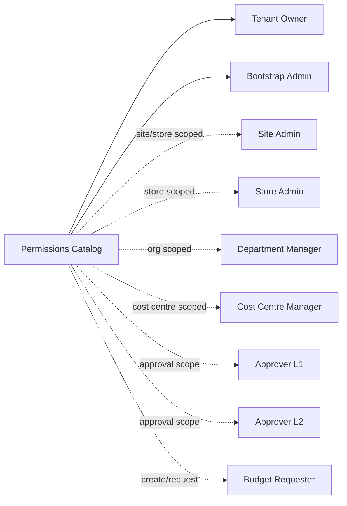
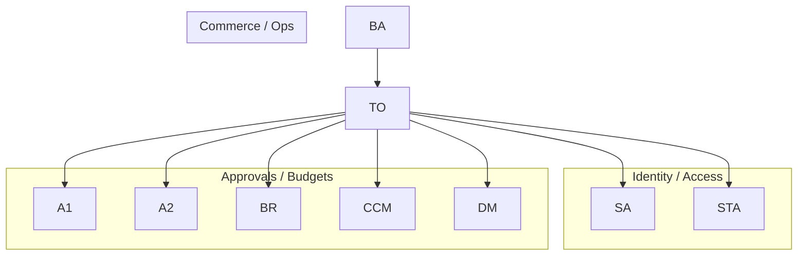

# Seed Roles and Permissions (ZeroQue)

Authoritative list of permissions and recommended default roles to seed for multi-tenant onboarding. Codes follow the existing naming style (`domain.resource.action`). Use these to populate the `permissions` table and attach to roles in `roles`/`role_permissions` plus optional scopes in `role_scopes`.

---

## Permission Catalog (grouped by domain)

- tenants.create — Create tenants
- tenants.view — View tenant profiles
- tenants.update — Update tenant details/settings
- tenants.deactivate — Deactivate tenants
- tenants.delete — Delete tenants (hard/soft)
- tenants.assign_site — Link/unlink tenants to sites
- tenants.billing.view — View tenant billing profile
- tenants.billing.update — Update tenant billing profile
- tenants.plan.change — Change tenant subscription plan
- tenants.features.configure — Enable/disable tenant features
- tenants.keys.manage — Rotate tenant API keys

- sites.create — Create sites
- sites.view — View sites
- sites.update — Update sites
- sites.delete — Delete sites
- sites.manage — Full site management (existing)

- stores.create — Create stores
- stores.view — View stores
- stores.update — Update stores
- stores.delete — Delete stores
- stores.manage — Full store management (existing)
- stores.products.manage — Manage store product assortment (existing)
- stores.products.view — View store product assortment (existing)

- users.create — Create users
- users.view — View users
- users.update — Update users
- users.deactivate — Deactivate/activate users
- users.password.reset — Reset user passwords (existing)
- users.roles.assign — Assign roles to users
- users.roles.view — View user roles
- users.scopes.assign — Assign scopes to users
- users.api_keys.manage — Manage user API keys

- users.manage — Full user management (existing)

- roles.create — Create roles
- roles.view — View roles
- roles.update — Update roles
- roles.delete — Delete roles
- roles.assign — Assign roles to users
- roles.scopes.manage — Manage role scopes
- roles.copy — Duplicate roles
- permissions.view — View permission catalog
- admin.permissions.manage — Manage permission catalog (existing)
- admin.roles.manage — Manage roles (existing)
- admin.scopes.manage — Manage RLS scopes (existing)

- org_units.create — Create org/department units
- org_units.view — View org/department tree
- org_units.update — Update org units
- org_units.delete — Delete org units
- org_units.assign — Assign users to org units (existing)
- org_units.manage — Full org unit management
- org_units.tree.export — Export org structure

- vendors.create — Create vendors
- vendors.view — View vendors
- vendors.update — Update vendors
- vendors.delete — Delete vendors
- vendors.manage — Full vendor management (existing)

- cost_centres.create — Create cost centres
- cost_centres.view — View cost centres
- cost_centres.update — Update cost centres
- cost_centres.delete — Delete cost centres
- cost_centres.assign_users — Assign users to cost centres
- cost_centres.budget.allocate — Allocate budget to cost centres
- cost_centres.budget.adjust — Adjust cost centre budgets
- cost_centres.reports.view — View cost centre reports
- cost_centres.manage — Full cost centre management (existing)

- budgets.manage — Manage budgets (existing)
- budgets.manage.subordinates — Manage budgets for subordinates only (existing)
- budgets.view — View budgets
- budgets.approval_rules.manage — Manage budget approval rules
- budgets.workflow.manage — Manage budget workflows
- budgets.instant.request — Request instant budget (existing)
- budgets.instant.approve — Approve instant budget (existing)
- budgets.reports.view — View budget reports
- budgets.audit.view — View budget audit trail

- approvals.chains.manage — Manage approval chains/steps (existing)
- approvals.steps.manage — Manage individual approval steps
- approvals.requests.create — Create approval requests (existing)
- approvals.requests.view — View approval requests
- approvals.requests.respond — Approve/reject requests (existing)
- approvals.requests.cancel — Cancel approval requests
- approvals.delegations.manage — Manage approval delegations
- approvals.reports.view — View approval reports

- catalog.products.manage — Manage products (manage complete proucts, categories, variants, price etc, everything)
- catalog.products.view — View products (existing)
- catalog.products.create — create products
- catalog.products.delete — Delete products

- stores.products.view — View store assortment (existing duplicate for clarity)
- stores.products.manage — Manage store assortment (existing duplicate for clarity)
- stores.products.create - create store assortment
- stores.products.delete - delete store assortment

- entitlements.check — Check entitlements (existing)
- entitlements.usage.record — Record usage (existing)
- entitlements.usage.view — View usage (existing)
- entitlements.usage.manage — Manage/reset usage (existing)
- entitlements.features.manage — Manage feature definitions
- entitlements.features.view — View feature definitions
- entitlements.metering.manage — Manage metering setup

- subscriptions.plans.manage — Manage subscription plans (existing)
- subscriptions.plans.view — View subscription plans (existing)
- subscriptions.features.manage — Manage subscription features (existing)
- subscriptions.features.view — View subscription features (existing)
- subscriptions.tenant.manage — Manage tenant subscriptions (existing)
- subscriptions.tenant.view — View tenant subscriptions (existing)
- subscriptions.trials.manage — Manage trials
- subscriptions.cancellations.manage — Manage cancellations
- subscriptions.invoices.view — View subscription invoices
- subscriptions.renewals.manage — Manage renewals

- payments.methods.manage — Manage payment methods
- payments.methods.view — View payment methods
- payments.charge — Charge payments
- payments.payouts.manage — Manage payouts
- payments.disputes.manage — Manage disputes/chargebacks
- payments.webhooks.manage — Manage payment webhooks

- orders.create — Create orders
- orders.view — View orders
- orders.update — Update orders
- orders.cancel — Cancel orders

- orders.export — Export orders

- ledger.entries.post — Post ledger entries
- ledger.entries.view — View ledger entries
- ledger.accounts.manage — Manage ledger accounts
- ledger.reports.view — View ledger reports
- ledger.export — Export ledger data

- billing.invoices.create — Create invoices
- billing.invoices.view — View invoices
- billing.invoices.send — Send invoices
- billing.invoices.void — Void invoices

- billing.statements.view — View billing statements

- provisioning.import — Bulk import tenants/sites/stores/users
- provisioning.export — Export provisioning data
- provisioning.templates.manage — Manage provisioning templates

- audit.logs.view — View audit logs
- audit.logs.export — Export audit logs
- audit.trails.view — View detailed trails

## Default Roles to Seed (assign permissions per tenant at onboarding)

- Tenant Owner — All permissions for the tenant (can delegate admin, billing, security).

- Billing Admin — billing._, payments._, subscriptions._, tenants.billing._, invoices/credit/adjustments.
- Finance Manager — payments._, ledger._, billing.invoices._, cost_centres.budget._, budgets.manage.
- Procurement Manager — vendors.\*, catalog.products.manage, catalog.categories.manage, catalog.attributes.manage, approvals.requests.create.
- Catalog Manager — catalog.\* (manage categories, products, variants, media, price lists, tax).
- Pricing Manager — pricing._, catalog.pricelists._, catalog.tax.\*, catalog.products.publish.
- Inventory Manager — inventory._, stores.inventory._, catalog.inventory.\*, stores.products.manage (assortment).
- Site Admin — sites._, stores._ for assigned sites; read tenants.\*.
- Store Manager — stores._, shopping._, inventory.adjustments.\*, orders.view/update/fulfillment; limited pricing.view.
- Org/Department Manager — org_units.\*, users.view, users.roles.view, cost_centres.assign_users, budgets.manage.subordinates.
- Cost Centre Manager — cost_centres.\*, budgets.manage.subordinates, budgets.view.
- Approver Level 1 — approvals.requests.respond (L1 scope), approvals.requests.view, budgets.instant.approve (subordinate), approvals.delegations.manage (self).
- Approver Level 2 — same as L1 plus higher approval limits.
- Approver Level 3 / Exec Approver — highest approval limits; approvals.chains.manage.
- Budget Requester — budgets.instant.request, approvals.requests.create, shopping.checkout, orders.create.
- Entitlements Admin — entitlements.\* plus subscriptions.features.view/manage.
- Subscription Admin — subscriptions.\*, tenants.plan.change.
- Payments Ops — payments.\*, disputes.manage, refunds.manage, payment methods manage.
- Orders Ops — orders.\*, returns.manage, refunds.manage, fulfillment.update.
- Support Agent — users.view, tenants.view, sites.view, stores.view, orders.view, audit.logs.view (masked), support.tickets.manage, support.impersonate (scoped).
- Read Only — \*.view permissions across domains (no mutations).
- Auditor — audit.logs.view/export, ledger.export, reports.export, data.export (read only elsewhere).
- Integration Admin — integrations.\*, webhooks.manage, api keys manage for integrations.
- CV Admin — cv.\*, integrations.monitoring.view (for CV), catalog view.
- Developer (Service-to-Service) — Scoped to APIs: catalog._.manage, provisioning.import/export, integrations._, data.export/import, metrics.view (no approvals/billing unless needed).

## Role → Permission mapping (seeded)

- Tenant Owner: all permissions (`*`).
- Site Admin: tenants.view, sites.\*, stores.\*, users.view, users.roles.view (scope to sites/stores via `role_scopes`).
- Store Admin: stores.\*, orders.view/update/cancel/export (scope to store via `role_scopes`).
- Department Manager: org_units.\*, users.view, users.roles.view, cost_centres.assign_users, budgets.manage.subordinates, budgets.view (scope to org_unit via `role_scopes`).
- Cost Centre Manager: cost_centres.\*, budgets.manage.subordinates, budgets.view (scope to cost centre via `role_scopes`).
- Approver Level 1: approvals.requests.view/respond, approvals.delegations.manage, budgets.instant.approve (scope to org/site/store as needed).
- Approver Level 2: L1 set + approvals.chains.manage, approvals.steps.manage.
- Budget Requester: budgets.instant.request, approvals.requests.create, orders.create.
- Bootstrap Admin: all permissions (`*`) — internal use; initial admin also gets Tenant Owner.

## Visual (who gets what)

### Visual Role Coverage by Domain

Notes:

- Assign scopes (`role_scopes`) to limit Site Admin/Store Manager/Org Manager/Approver roles to specific sites/stores/org units.
- Keep `admin.env.write` and `security.rls.override` only for platform super-admins, not tenant roles.
- When seeding, also create a bootstrap “Bootstrap Admin” with Tenant Owner + Security Admin + Billing Admin for the bootstrap tenant (already partly handled in `ensure_bootstrap_admin`).

---

## Seeding Guidance

1. Insert all permission codes above into `permissions` (id, code, description).
2. Create roles above in `roles` (id, code, description).
3. Map role-permission pairs in `role_permissions`, using scopes for tenant/site/store/org-unit where applicable.
4. For onboarding, assign Tenant Owner + Tenant Admin + Billing Admin + Security Admin to the initial admin user; others can be self-served later.
5. Keep permission names stable; deprecate rather than rename to avoid migrations.
